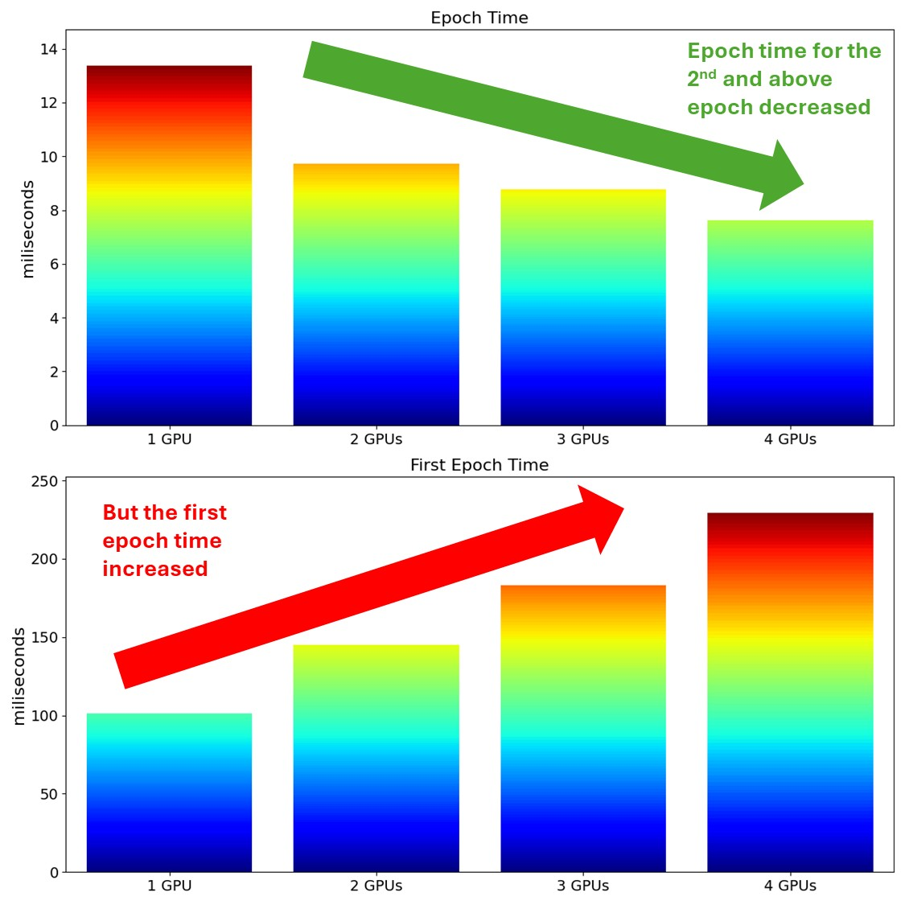

# An Example of Using Multi-GPU with Tensorflow Distributed
This repository demonstrates an example of using multi-GPU with Tensorflow Distributed

## Installation

To install necessary libraries to run the codes in this repository, you can run the following bash command:

```bash
python3 -m pip install 'tensorflow[and-cuda]'
```

## Usage

There are 4 notebooks in this repository, each of the notebook demonstrates how to use 1, 2, 3, and 4 GPU(s) using Tensorflow Distributed. The difference between these 4 notebooks is only at the following line in the 3rd cell:
```python
strategy = tf.distribute.MirroredStrategy(devices=[LIST_OF_GPUS]))
```

## Performance Benchmark

As shown in the following plot, using more GPUs can decrease the epoch time. However, the first epoch time increased instead.


